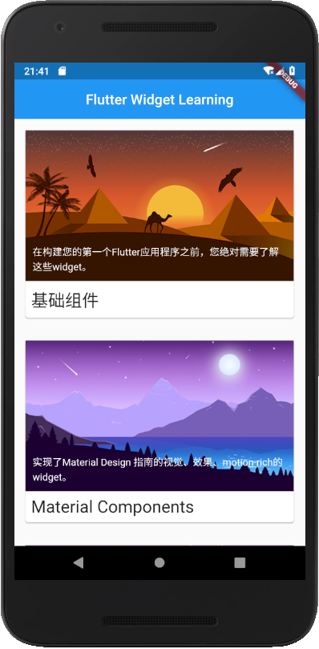
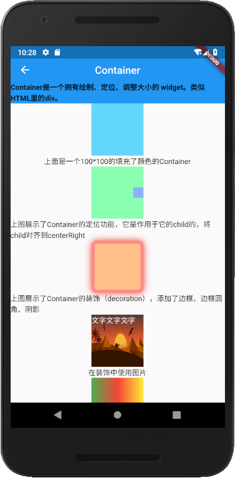
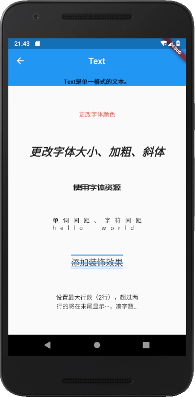
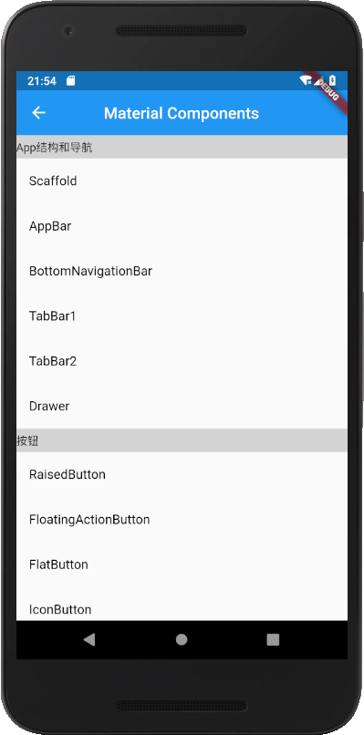
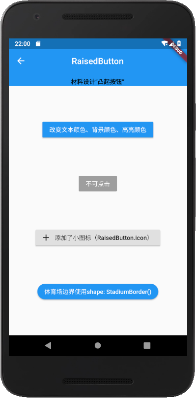
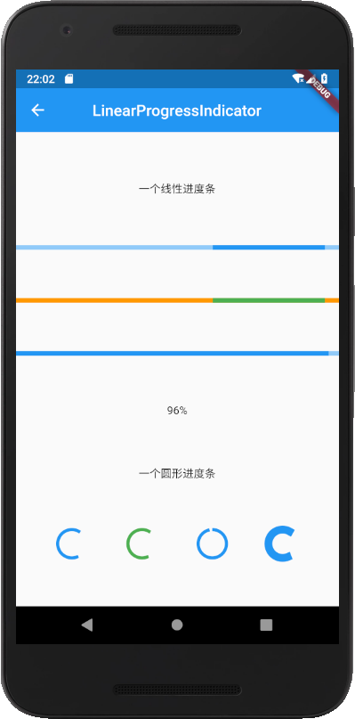
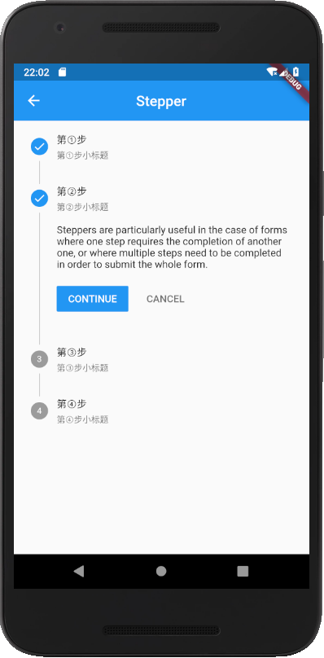
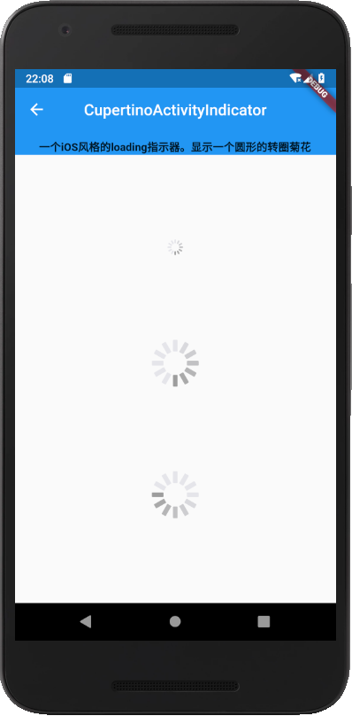
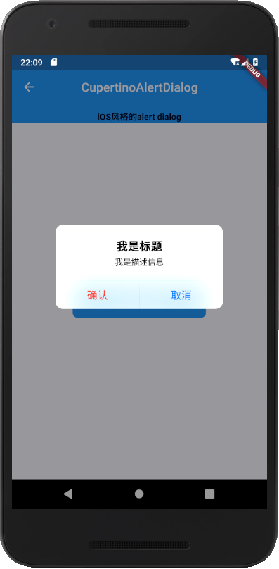
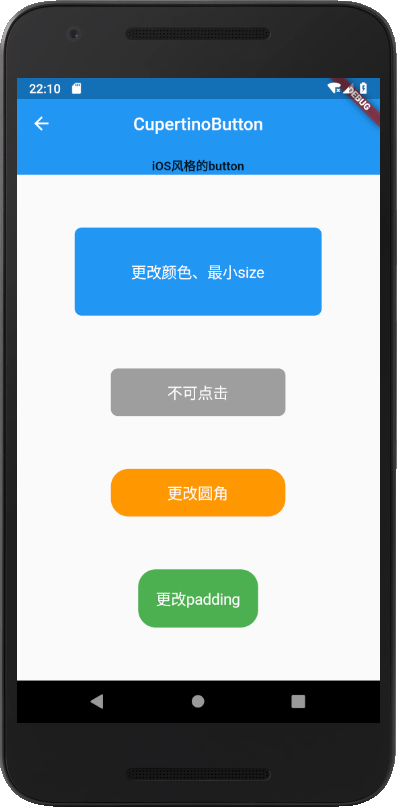

# flutter_widget

根据[flutter中文网widget目录](https://flutterchina.club/widgets/)编写的widget的使用方法，可以对照着flutter中文网的目录和本项目的代码进行查看，适合flutter入门学习

## 基础组件
在构建您的第一个Flutter应用程序之前，您绝对需要了解这些widget。  
具体基础组件目录请参考[基础组件](https://flutterchina.club/widgets/basics/)  
项目代码地址[基础组件代码](https://github.com/huang-weilong/flutter_widgets/tree/master/lib/basic)  

  
## Material Components
实现了Material Design 指南的视觉、效果、motion-rich的widget。  
具体Material Components目录请参考[flutter中文网Material Components](https://flutterchina.club/widgets/material/)  
项目代码地址[Material Components代码](https://github.com/huang-weilong/flutter_widgets/tree/master/lib/material_components)  

## Cupertino(iOS风格的widget)
用于当前iOS设计语言的美丽和高保真widget。  
具体Cupertino(iOS风格的widget)目录请参考[Cupertino(iOS风格的widget)](https://flutterchina.club/widgets/cupertino/)  
项目代码地址[Cupertino(iOS风格的widget)](https://github.com/huang-weilong/flutter_widgets/tree/master/lib/cupertino)  

  
目前只完成了基础组件、Material Components以及部分Cupertino(iOS风格的widget)的Widget，其他部分将在后续更新。希望给个★Star支持，谢谢！
