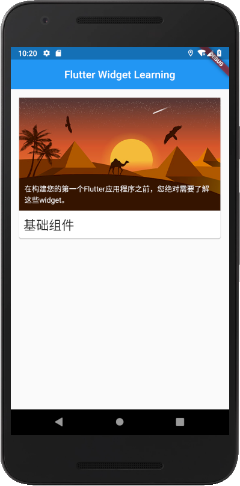

# flutter_widget

根据[flutter中文网widget目录](https://flutterchina.club/widgets/)编写的widget的使用方法，可以对照着flutter中文网的目录和本项目的代码进行查看，适合flutter入门学习

## 基础组件

在构建您的第一个Flutter应用程序之前，您绝对需要了解这些widget。  包含了Container、Row、Column、Image、Text、Icon、RaisedButton、Scaffold、AppBar、FlutterLogo、Placeholder  
  
目前只完成了基础组件的目录，其他部分将在后续更新。觉得不错给个★Star支持，谢谢！
